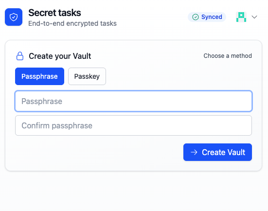

# PowerSync E2EE Monorepo

This repo contains examples and libraries for building end‑to‑end encrypted apps on top of PowerSync.

## Apps

- [packages/todo/frontend](packages/todo/frontend) — "Todo" (baseline app)
- [packages/todo-raw-query/frontend](packages/todo-raw-query/frontend) — "Todo (raw-query + encrypted mirrors)"

## What’s the difference between "todo" and "todo-raw-query"?

| Aspect | todo | todo-raw-query |
|---|---|---|
| Domain schema in PowerSync | PowerSync schema declares domain tables (e.g., `todos` with plaintext fields) | PowerSync sees only opaque encrypted raw tables; domain fields live only in a local plaintext mirror |
| Encryption | Decrypts inside components per row | Centralized in `@crypto/sqlite`; components read from a maintained plaintext mirror |
| Keys | Per‑list keys | Single per‑user key (password or WebAuthn) |
| Reads | Direct PowerSync queries of raw table | `useQuery` on mirror table (e.g., `todos_plain`) |
| Writes | Direct SQL writes to raw domain table | `insertEncrypted` / `updateEncrypted` / `deleteEncrypted` via `@crypto/sqlite` |
| DDL | Defined in app’s PowerSync schema | Created by `ensurePairsDDL()` (encrypted + mirror + triggers) |

### Links

- Todo (baseline): [packages/todo/frontend](packages/todo/frontend)
- Todo (raw-query + mirrors): [packages/todo-raw-query/frontend](packages/todo-raw-query/frontend)

## Crypto packages

- [packages/crypto/interface](packages/crypto/interface)
  - Shared types and helpers (`CipherEnvelope`, base64 helpers, etc.) used by crypto providers.
- [packages/crypto/encrypted-sqlite](packages/crypto/encrypted-sqlite)
  - Generic encrypted↔mirror runtime for SQLite/PowerSync: pair configs, `ensurePairsDDL`, `startEncryptedMirrors`, `insertEncrypted`/`updateEncrypted`/`deleteEncrypted`, and hooks.
- [packages/crypto/password](packages/crypto/password)
  - Password-based crypto provider (PBKDF2 by default) implementing the `CryptoProvider` interface for wrapping/unwrapping DEKs.
- [packages/crypto/webauthn](packages/crypto/webauthn)
  - WebAuthn-based crypto provider using PRF/hmac-secret extensions to derive a stable secret per credential (wrap/unwrap DEKs using passkeys).

Each app consumes these packages to implement E2EE in the browser and keep ciphertext opaque to the PowerSync backend.
